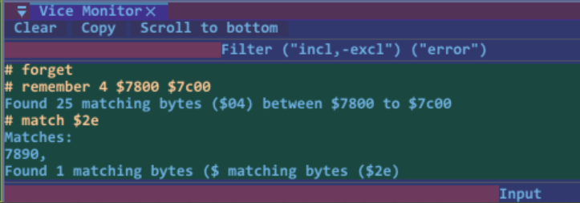
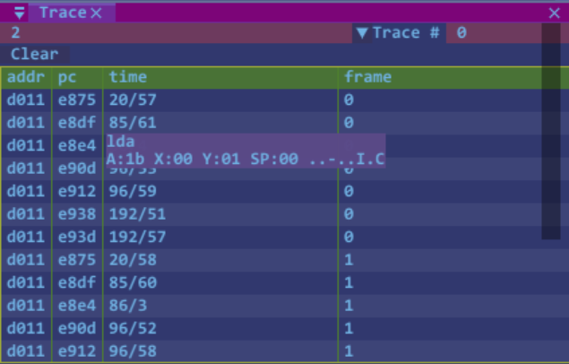

# Cracker Barrel

The tools created for reverse engineering and analyzing machine code ("Cracking") have long influenced the design of modern debuggers. IceBro Lite draws on that history, but it is primarily meant to be a practical tool for building new programs and understanding how they behave.

## Tracking changes in memory

The console commands `remember`, `match`, and `forget` let you track values that change over time. This is especially useful for things like lives, pickups, counters, or other values that are updated while the program runs.



First, find the byte or byte range you want to follow in a memory range. For example, to track three lives, use the `remember` console command:

```text
remember <byte>[-<byte>] [<addr> <addr>]
```

Then run the game until the value changes. When a life is lost or an item is collected, the value in memory changes. You can then search the previously remembered locations for the new value with `match`:

```text
match <byte>[-<byte>] [<addr> <addr>] [clear|filter|trace|watch]
```

By default, `match` shows all remembered locations that now contain the matching value. You can also narrow the results by including `filter`.

Another useful way to use the system is to add matching values as traces. A trace is a built-in VICE feature that works like a breakpoint but does not stop execution; it simply logs that the event happened.

## Using Trace View

VICE trace points normally write to the console view whenever the CPU reads from or writes to a memory address.

So, if you find the memory address for the number of lives remaining, you can add a trace point for that address and then quickly locate the code addresses where the byte was read or changed.



In this example, the trace is set for `$d011`, which changes often during a frame.

The Trace view also tracks the raster line, horizontal screen position, register flags, and more. Because you can have multiple trace points active at once, the Trace view lets you choose which trace point to display from the drop-down menu in the top-right corner of the window.

## GfxView

Extracts the current screen data from memory and saves four files containing what is needed to show the image.

```
prg.chr
prg.col
prg.scr
prg.txt
```

First the video registers in a text file

```
; Info for screendump files prg
; Used characters: 114
mode: Text Multi-Color
d011: $15
d016: $d8
d018: $ed
d020: $00
d021: $09
d022: $08
d023: $0a
```

Then .chr contains the font characters or bitmap data, .col contains color ram and .scr the screen memory.
