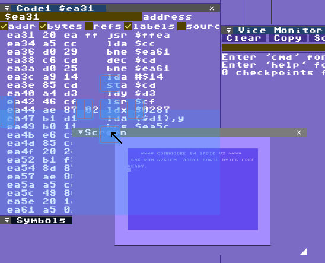
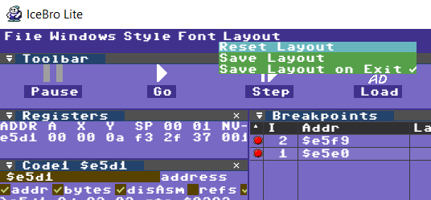

# Customizing your debugging window

The IceBro Lite debugging window is fully customizable. It is made up of separate panes, which you may move around and reorganize at will. This is similar to the way e.g. Visual Studio organizes windows. 

Close the panes you don’t need. Reopen them again – or open new ones – from the Windows drop-down menu. 

In order to move a pane around, grab it by its tab (the bar with the name of each pane, such as Code, Graphics, Watch, etc.) then drag it around with your mouse. If you place it on top of an anchor in another pane the debugger will preview where the pane will be placed if you drop it.

Panes can also be dropped outside of the main window and become detached windows, onto which other panes may be attached. This makes it possible to work with multiple groupings of windows.

If you reopen a closed pane, it will reappear at its most recent location. You reopen panes from the Windows menu.

Should any problem arise with the tool layout, you may reset it from the drop-down menu.

To re-open closed windows simply select them from te Windows drop down menu.
