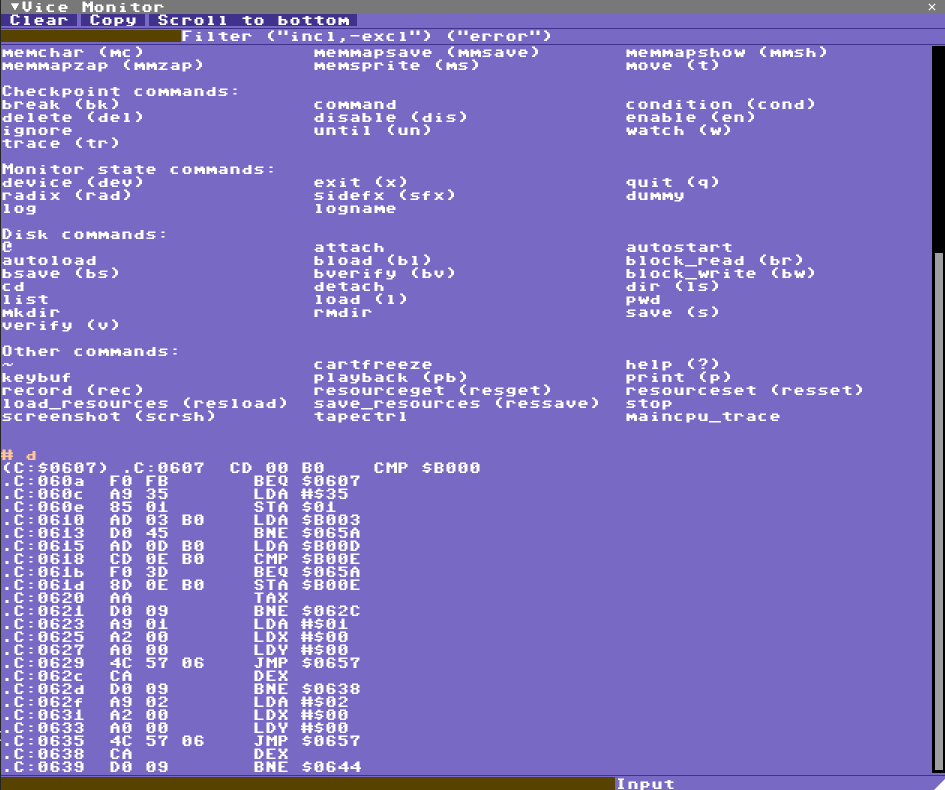

## Console View

This is a combination of the VICE text monitor, if enabled in VICE, and some extra commands for IceBro Lite.

To use the console view the remote monitor must be enabled in VICE in addition to the remote binary monitor. This enables a few more features not available in the binary protocol. Tracepoint output will be filtered into the Trace View instead.

Type help or ? for a list of VICE commands when connected to VICE, or type CMD for a list of IceBro Lite commands. VICE text monitor output will be shown in this view.

* [back to manual](index.md)
* [back to views](views.md)

## Vice Console IceBro Commands
 * connect/cnct [\<ip\>:\<port\>] - connect to a remote host, default to 127.0.0.1:6510;
 * pause
 * font \<size:0-6\>
 * eval \<exp\>
 * history/hist;
 * clear
 * poke
 * remember
 * forget
 * match

type cmd <command> for more information on some commands.

### Remember command

	remember <byte>[-<byte>] [<addr> <addr>]
 
Clears the matches and stores a new set
of matches in the memory range.
Identical to match <byte> <addr> C[lear]

### forget command:

	forget
Clears the match buffer, same as match C[lear]

### match command:
	match <byte>[-<byte>] [<addr> <addr>] C[lear] F[ilter] T[race] W[atch]
Match will compare the byte range within
the address range to a stored list of
previous matched addresses.
byte range can be prefixed with '!' for inverted range.

If the list had previous matches it will print out the addresses that current match.

Controls: (must be after byte/address range)
  * C[lear]: clear any current results first
  * F[ilter]: remove all non-matching results for another run
  * T[race]: add a Trace store for the matching results
  * W[atch]: add a Watch store for the matching results

Example: find all values between 3 and 5 and clear the list:

	match 3-5 clear

Find all remembered values that are no longer between 3 and 5 within an address range, filter the list from previous results

	match !3-5 $1000-$8000 filter

Find all remembered values that are equal to 2, filter the list and add a watch store to each

	match 2 filter watch

### poke command:
	poke <addr>,<byte>
 Store a byte in a specific memory location, VICE
 does not need to be in a break state for this command.
 addr and byte can expressions so if you have loaded
 relevant symbols you can f.e. poke VICREGS+32, 3+2

