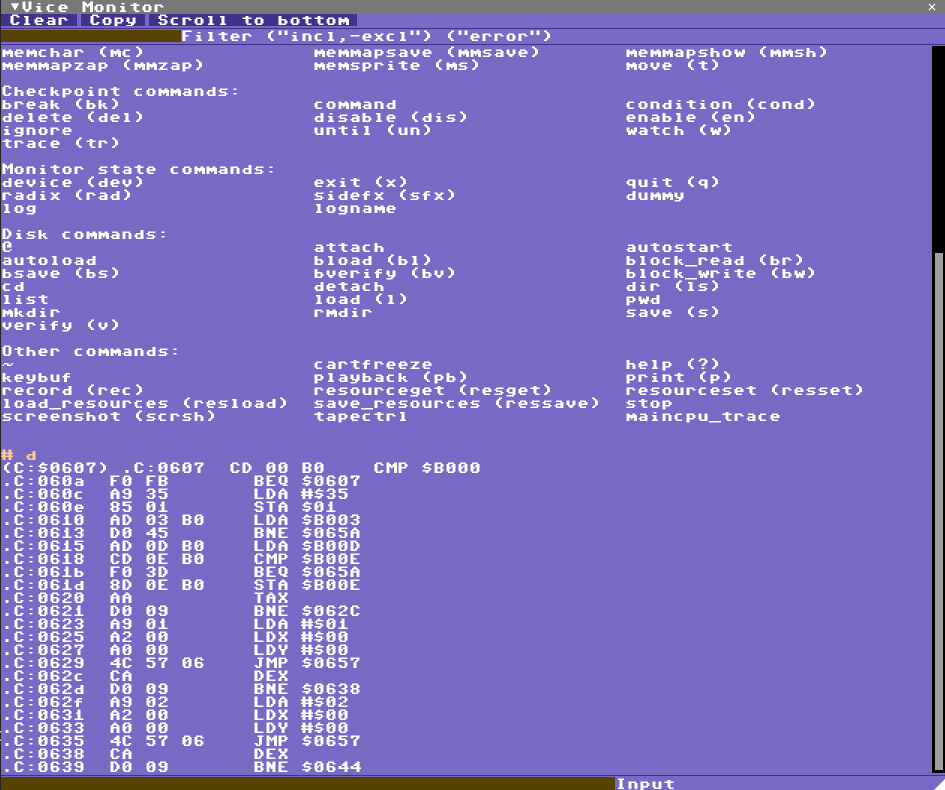

## Console View

The console view combines VICE's text monitor output with a small set of IceBro Lite commands. It is most useful when the Remote Monitor is enabled in VICE alongside the Binary Remote Monitor.

Type `help` or `?` for VICE commands when connected to VICE, or `cmd` for a list of IceBro Lite commands. Tracepoint output is routed into the Trace View rather than the console.

* [back to manual](index.md)
* [back to views](views.md)

## IceBro Lite console commands

* `connect` / `cnct [<ip>:<port>]`: connect to a remote host (default `127.0.0.1:6510`)
* `pause`: stop VICE
* `font <size:0-6>`: adjust the console font size
* `eval <exp>`: evaluate an expression
* `history` / `hist`: show command history
* `clear`: clear the console log
* `poke <addr>,<byte>`: write a byte to memory; both values may be expressions
* `remember <byte>[-<byte>] [<addr> <addr>]`: remember matching bytes in a range
* `forget`: clear the remembered matches
* `match <byte>[-<byte>] [<addr> <addr>] [clear|filter|trace|watch]`: match remembered bytes and optionally create checkpoints
* `gfxsave [<name>]`: export the current graphics screen to a set of files using the supplied base name

Use `cmd <command>` for help on a specific console command.

### `remember`

```text
remember <byte>[-<byte>] [<addr> <addr>]
```

Stores a new set of matches in the requested address range. It is the same idea as `match <byte> <addr> clear`.

### `forget`

```text
forget
```

Clears the remembered match buffer.

### `match`

```text
match <byte>[-<byte>] [<addr> <addr>] [clear|filter|trace|watch]
```

Compares the current memory contents with the remembered byte range. The `clear` flag resets the current results first, `filter` removes non-matching entries from the current result set, `trace` creates tracepoints and `watch` creates watchpoints.

### `gfxsave`

```text
gfxsave [<name>]
```

Exports the current graphics screen to a set of files using the supplied base name. If no name is supplied, the command uses `gfxsave` as the default name. It writes a `.txt` metadata file, a `.scr` screen dump, a `.col` color dump, and a `.chr` character dump for the detected graphics mode.

### `poke`

```text
poke <addr>,<byte>
```

Writes a byte to memory even while VICE is running. Both operands may be expressions.


