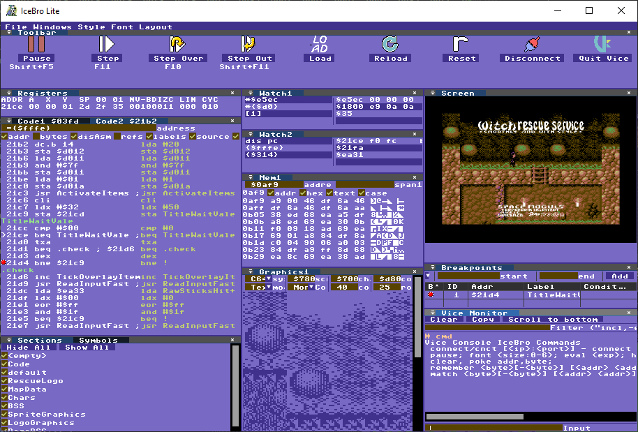

Ice Bro Lite is a visual GUI debugger that connects to the VICE C64 emulator (version 3.5 and higher).

It works by connecting to the Binary Monitor in VICE, and for some features the Remote Text Monitor. This tool can be downloaded for [Windows](https://github.com/Sakrac/IceBroLite/releases) and compiled for [Linux](linux.MD) and [Mac](mac.MD).

The latest version of VICE can be downloaded from [here](https://vice-emu.sourceforge.io/index.html#download).

# Manual
1. [Updated Features](updates.MD)
2. [Set up Ice Bro Lite](setup.md)
3. [Command Line Options](command_line.MD)
3. [Customizing the debugger windows](customize.MD)
4. [Start Debugging](start.MD)
5. [Views](views.MD)
   * [Breakpoint ViewManual Page](view_breakpoints.MD)
   * [Code View Manual Page](view_code.MD)
   * [Graphics View Manual Page](view_gfx.MD)
   * [Ice Console Manual Page](ice_console.MD)
   * [Watch View Manual Page](view_watch.MD)
6. [Numeric Expressions](expressions.MD)
7. [Acknowledgements](acknowledgements.MD)
8. [History](history.MD)

**Feedback is always welcome**

I'd love to hear thoughts about IceBro Lite and ways to improve it, for instance on twitter [@spacemoguls](https://twitter.com/spacemoguls).

