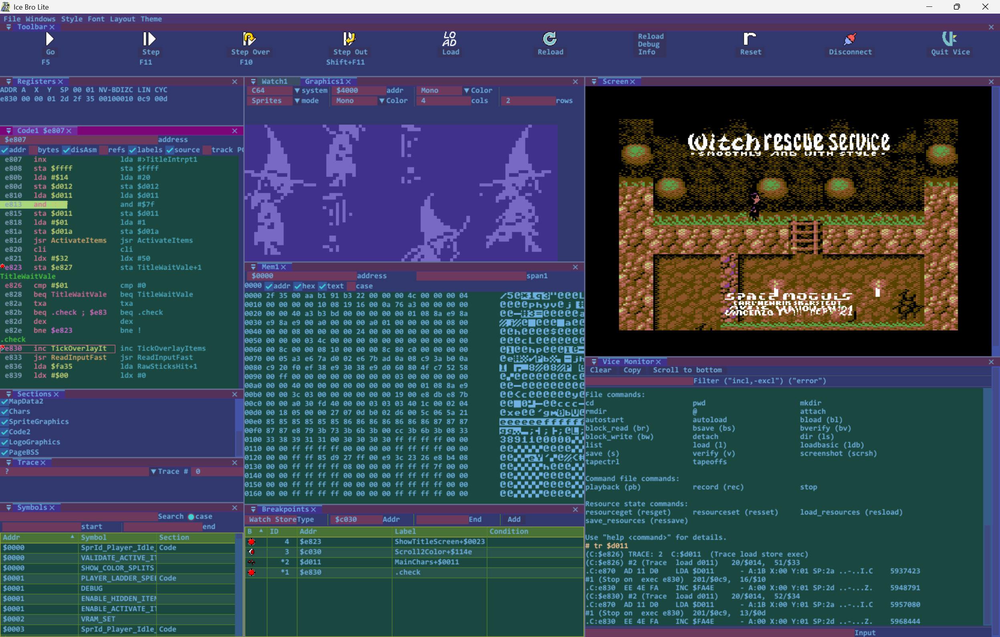

Ice Bro Lite is a visual debugger for the VICE C64 emulator that makes machine-level troubleshooting feel far more approachable. It brings together source, disassembly, memory, registers, watches, breakpoints, trace data and graphics in a flexible, dockable workspace.

It connects directly to VICE's Binary Monitor for core debugging data and the Text Monitor for console-based features. The latest version of VICE can be downloaded from [here](https://vice-emu.sourceforge.io/index.html#download).

# Manual
1. [Updated features](updates.MD)
2. [Set up Ice Bro Lite](setup.md)
3. [Command line options](command_line.MD)
4. [Customizing the debugger windows](customize.MD)
5. [Start debugging](start.MD)
6. [Views](views.MD)
   * [Breakpoint view](view_breakpoints.MD)
   * [Code view](view_code.MD)
   * [Graphics view](view_gfx.MD)
   * [Ice console](ice_console.MD)
   * [Watch view](view_watch.MD)
7. [Numeric expressions](expressions.MD)
8. [Acknowledgements](acknowledgements.MD)
9. [History](history.MD)

**Feedback is always welcome**

If you have ideas, bug reports or a favorite debugging workflow to share, the project would love to hear from you.

