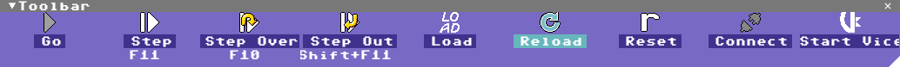
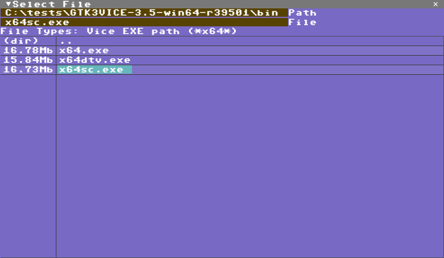
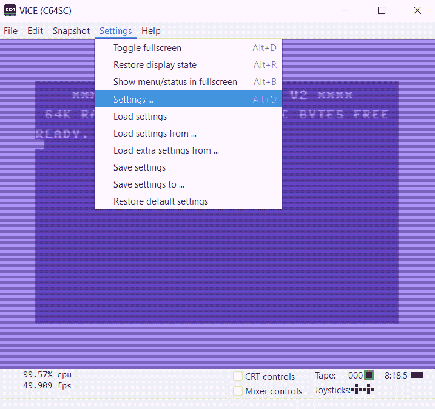
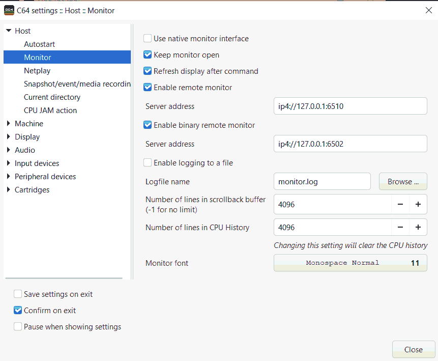
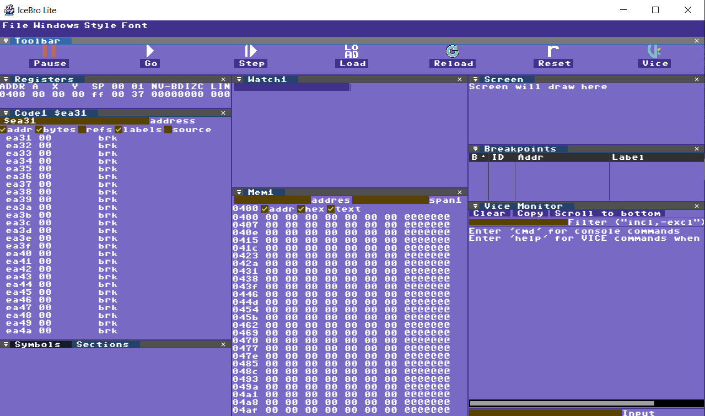
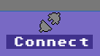
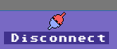

# Setting up your system

## The simple way

Start up IceBro Lite, the click on **Start Vice** to the far right.

The first time you Start Vice you will see a file dialog where you can locate x64sc.exe (or x64.exe if you built that). If you save settings or exit the debugger properly it will remember the path next time and just load it up.

Now you're ready to go! Just click **Load** in the toolbar to pick your .prg or .d64 or .crt file and start fixing things :)

If this works for you feel free to skip the manual setup!

## The manual way

### VICE Settings

To set up your system for debugging, do the following:
1) Enable external debugging in VICE. You normally only need to do this once as long as you save the settings

2) Connect the debugger to VICE. This you have to do every time you start the debugger up.

Alternatively to the above steps you can start IceBro Lite and then start VICE from the File/Load VICE menu which will start VICE with the settings enabled.
  
The following sections will describe these steps in detail.
## Enable external debugging in VICE

To enable external debugging in VICE, you must enable the binary monitor and – ideally – the text mode monitor protocols.

Please note that if you wish to enable the built-in monitor of the VICE emulator again, you may have to disable external debugging. 

Follow these steps to enable external debugging in VICE:

**Step 1**: Go to Settings / Settings in the menu.
First find the settings menu 

**Step 2**: Check Enable Remote Monitor and Enable Binary Remote Monitor in the Host / Monitor sub-menu.

**Step 3**: (not mandatory) Check Save settings on exit to avoid having to repeat the procedure at a future point.

**Step 4**: Done! VICE is now ready to accept a binary debugger connection.

# Connect the debugger to VICE

The EXE file for IceBro Lite is called IceBroLite.exe. It’s warmly recommended to launch the file directly from the command prompt – or from a batch script – in your project folder. This is because the debugger will save its layout in a text file in the folder from where it was launched.

Note: If you are using source control (git, svn, etc.), consider ignoring "icebrolt.ini" in your project directory if using in different environments as it stores full path names to previously loaded files.

**Step 1**: Launch IceBroLite.exe (see recommendations earlier in this section).

**Step 2**: Make sure VICE is running and has the binary remote monitor enabled.

**Step 3**: Click on the VICE icon at the top right corner of the screen.

When the icon looks like this VICE is connected:

If you press it again VICE disconnects.

**Step 4**: Press the **PAUSE** icon or Shift+F5 to look around in the current memory of VICE's C64 instance.

**Step 5**: Done!

