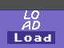
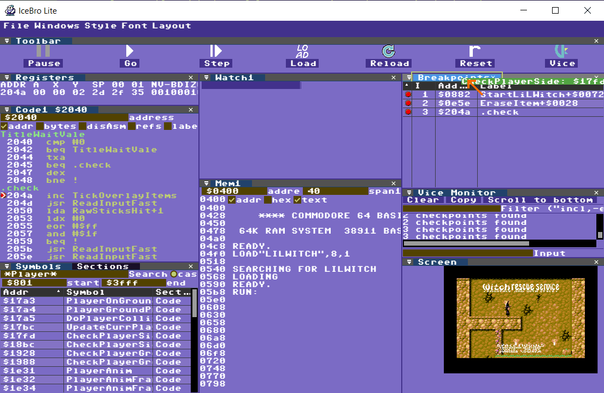

# Start Debugging

Note that when connected to VICE, the debugger will only update the machine state after you’ve stopped VICE. There are several ways to stop VICE:
- Press the pause button in the debugger
- Hit Alt+H in Vice
- Hit a breaking checkpoint (break, watch) while executing the code.

## Start executing the program to debug
There are two ways to go about debugging a program in IceBro Lite:
1) Start executing the program in VICE, then connect the debugger to VICE.
2) Connect VICE to the debugger, then load (and reload) the program from within the debugger and execute it from there.

### Executing code from VICE

If you execute code from VICE you can browse for the appropriate symbol file from the debugger "File" menu. When the program is running, you can stop it from inside the debugger.

###Executing code from IceBro Lite

Follow these steps to launch a program from IceBro Lite:

**Step 1**: Click the LOAD icon in IceBro Lite.

**Step 2**: Select a .prg/.d64 or .crt file from the file browser.

The debugger will now try to find a .dbg file (Kick Assembler debugger data), or .sym file (general assembler symbol file) or .vs file (Vice monitor commands). It will then load symbols and source debug at the same time.

When the files are loaded into the debugger, the debugger will stop twice before running the code: first before it starts loading, and second when it is about to run the loaded code.

To return to VICE just press F5 or press the play icon in the toolbar.

**Step 3**: Done!

## How to debug – tips and advice
Debugging operations mainly involve dragging a symbol or pointer from one pane into another pane, in order to see what it does there. For this purpose you can drag symbols and pointers from e.g. the Symbol browser or Breakpoint to the tabs of other panes, such as the Code view, the Breakpoint view or the Memory view.

In the image below, a symbol from the Symbol pane is dragged to the Breakpoints view. This adds the symbol as a breakpoint in VICE.

### Keyboard controls

Global keys
* **F5**: Return to VICE / Run
* **F11**: Step Into as in step one instruction and follow into jsr instructions
* **F10**: Step Over, same as F11 but don't follow into jsr instructions
* **Esc**: Exit the current edit

Code pane Keys
* **F6**: Run until line with purple cursor is reached or any prior breakpoint
* **F9**: Toggle breakpoint at line with purple cursor
* **Enter**: Edit code at line with purple cursor, Esc or Enter on empty line to stop.

Memory pane Keys (after clicking on a byte)
* **Cursor keys**: Move around the cursor in memory
* **Hex numbers**: Modify value in memory

Breakpoint pane Keys (after clicking on a breakpoint)
* **Up/Down**: Move through breakpoints
* **Delete**: Delete breakpoint

