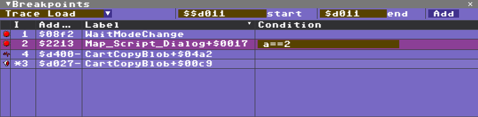

# Breakpoint View

The Breakpoint View lists the current checkpoints, including breakpoints, watchpoints and tracepoints. Breakpoints stop execution when the target address is reached, watchpoints stop on reads and/or writes to an address or range, and tracepoints record the event without stopping VICE.

* [back to manual](index.md)
* [back to views](views.md)

While debugging, the easiest way to create a breakpoint is usually from the Code View. The top of the Breakpoint View also offers a dropdown for creating other checkpoint types.

Items can be dragged from the table into other views. For example, dragging a checkpoint into the Code View opens the matching code, while dragging it into the Memory View shows the referenced address.

The checkpoint table also supports basic editing:
* click the checkpoint icon to enable or disable it
* add conditions from the row editor
* use the arrow keys to move among entries
* press Delete to remove the selected checkpoint

