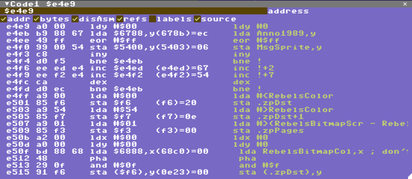

# Code View

Disassembly and Source Debugging lives here, but that is not all. There are a number of optional "columns" to customize this view

* [back to manual](index.md)
* [back to views](views.md)

* Address
* Bytes - the bytes that makes up each instruction
* Disassembly - you can hide the disassembly to save some screen space for Source Debugging
* References - looks at the address the instruction is referencing and shows what it currently contains
* Labels - *not* a column, but expands addresses in instructions into labels if found
* Source - show or hide source debugging (if available)
* Track PC - Keep the program counter roughly at the same line within the disassembly

Addresses can be selected in the disassembly by clicking on them.
A purple cursor shows the current selected address. Addresses can be navigated with cursor up/down and page up/down.

Keyboard shortcuts while the code view is selected:
* Tab: jump to current PC
* Shift+Tab: set PC to current selected address
* Cursor up/down: move cursor to previous/next addresss
* Page up/down: move cursor half a screen
* F9: Toggle breakpoint at line
* Enter: edit disassembly at address

The address field can be any expression  that evaluates, either a hex value preceeded by $ or a decimal value. It can also be an expression, see the Watch View for expression details.

If the address field expression is preceeded by = this means lock the view to the expression which can be handy to for example see the address of the jsr instruction that entered the code unless other data is on the stack:

	={$101+s}-2
