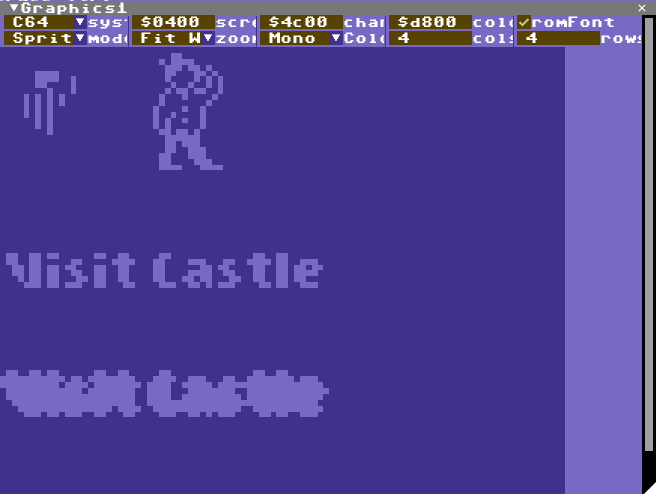
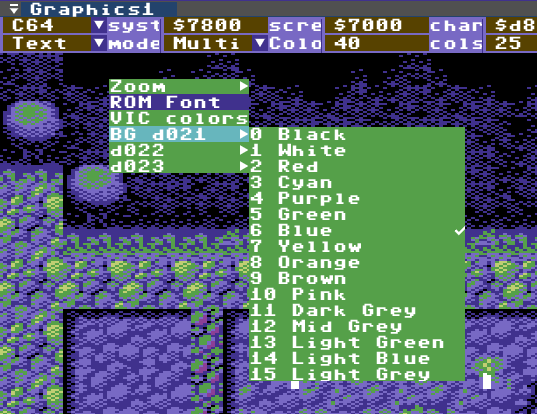
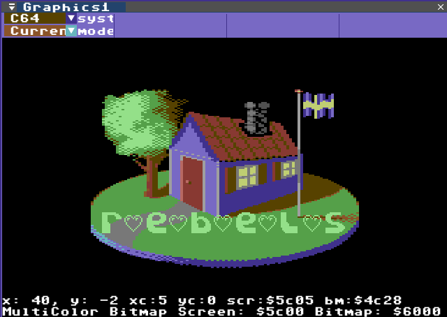
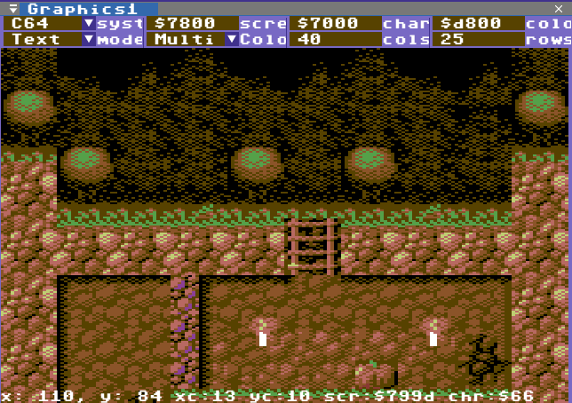
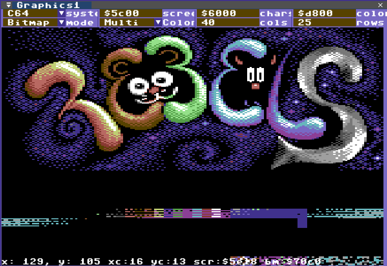
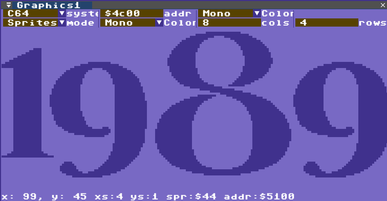

# Graphics View

The Graphics View is a viewer for graphics anywhere in RAM in a
variety of modes and you can have two graphics views up simultaneously.

This view has a lot of fields where addresses and numbers can be edited. It is a little complicated because the C64 has so many ways to show graphics. Here is a quick overview:
* System: C64 layouts or Special layout
* Screen: Address of Screen Data
* Chars: Address of font/bitmap/sprite
* Color: Address of color RAM (always $d800 on a C64, but can be pointed anywhere in the debugger)
* Mode: Current, Bitmap, Text or Sprite
* Cols: number of columns (chars or sprites)
* Rows: number of rows (chars or sprites)

If the Graphics View is selected press CTRL+C to copy the graphics to the clipboard (Windows only at the moment).

## Context Menu

Right click on the image to bring up the context menu

* Zoom: How to size the graphics in the view
* romFont: Graphics in $1000-$1fff and $9000-$9fff uses the built-in font data
* VIC Colors
* Custom colors (bg, fg, multicolors)
* etc.

---

## Current View

The current view looks at the VICII registers to determine what the current screenmode is. While the mouse cursor hovers over the image the coordinates are shown  at the bottom along with some information about the current screen registers.

Sprites are also drawn on this screen according to the VIC2 registers.

---

## Text View

The text mode includes per char color, multi color and extended color background mode (ECBM). Mono will draw the screen with a single color that can be set in the context menu.

---

## Bitmap View

The bitmap mode includes per char color/background and multi color bitmap. Mono will draw the foreground as a single color that can be set in the context menu.

---

## Sprite View

The sprite view shows a grid of sprites in either mono color or multicolor. For multicolor either VIC2 colors can be used or custom colors in the context menu.

If the mouse pointer is hovering over the sprite image there is additional information printed at the bottom of the screen relevant to that position.

