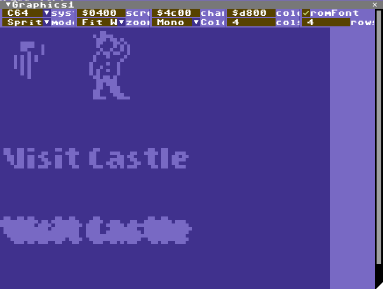
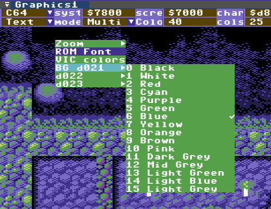
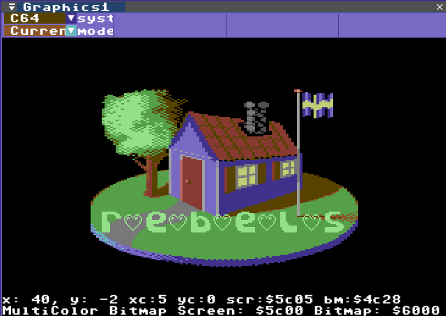
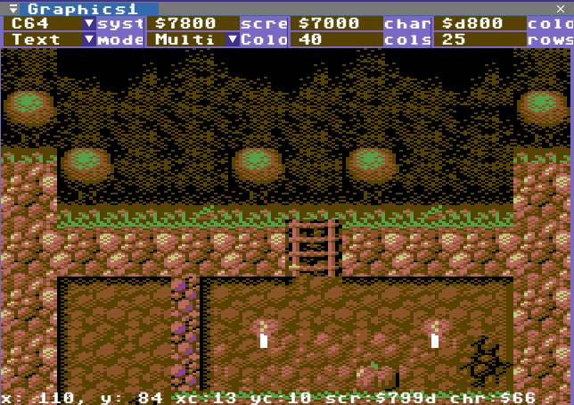
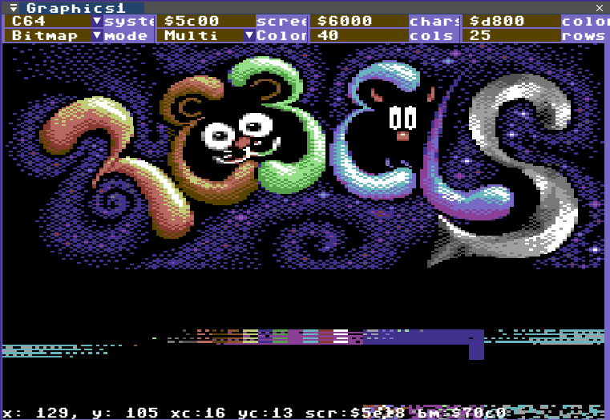
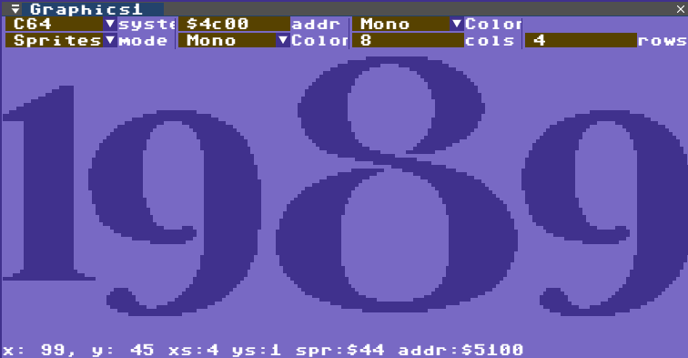

# Graphics View

The Graphics View displays screen, bitmap and sprite data from RAM using the current VIC-II settings. IceBro Lite can keep two graphics views open at once.

The view contains address and size fields for the screen data, character data, color RAM and the active mode. Common options include:

* System: standard C64 layouts or a custom layout
* Screen: address of the screen data
* Chars: address of font, bitmap or sprite data
* Color: address of the color RAM (often `$d800` on a C64)
* Mode: current, bitmap, text or sprite mode
* Cols / Rows: dimensions of the rendered data

Press Ctrl+C while the graphics view is focused to copy the current image to the clipboard on Windows.

* [back to manual](index.md)
* [back to views](views.md)

---

---

## Context menu

Right-click the image to open the context menu. It lets you adjust zoom, choose whether to use ROM font data, change the color palette and switch between different rendering modes.

---

## Current view

The current view derives its mode from the VIC-II registers. While the mouse is over the image, the status area shows the current coordinates and relevant register information.

---

## Text view

The text mode supports per-character colors, multicolor text and extended color background mode. The mono option renders the screen with a single foreground color.

---

## Bitmap view

The bitmap view supports per-character colors, multicolor bitmap mode and mono rendering. The context menu lets you choose the palette used for the foreground and background.

---

## Sprite view

The sprite view renders sprites in mono or multicolor mode. Hovering over a sprite displays metadata about that sprite's current position and state.

