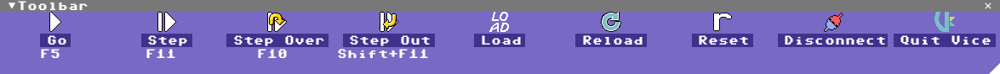
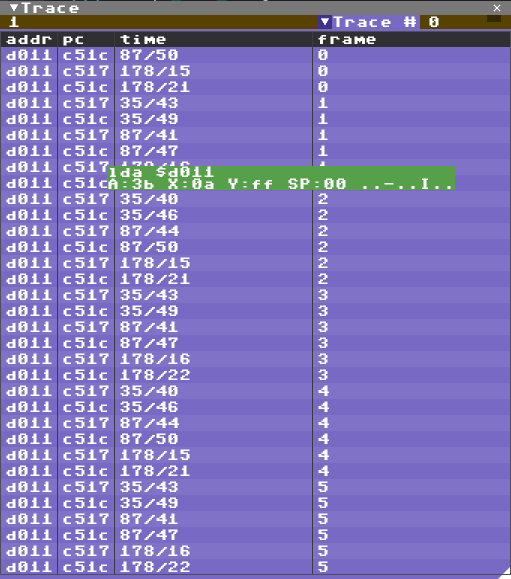
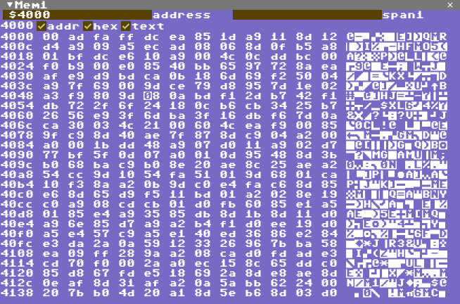
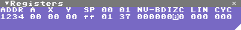
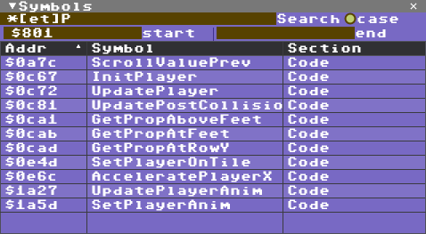
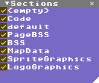

# Views

## Toolbar

The toolbar consists of buttons that controls the debugger and VICE such as Go/Stop, Step, Load a program/disk/cartridge or reload (a reload will clean VICE so you can iterate your code and start over without restarting VICE).
Connect will attach the debugger to an existing instance of VICE, Start VICE will try to start a new instance of VICE.
* Go/Stop: If VICE is connected start/stop execution, same as F5/Shift F5 on the keyboard.
* Step: If VICE is connected and stopped, step one instruction. Step in to jsr. Same as F11.
* Step Over: Step over jsr. Same as F10.
* Step Out: Run until exiting a subroutine (after calling jsr if possible). Same as Shift F11
* Load: Open the load program dialog, select a .prg, .d64 or .crt file. VICE will reset then load in the program.
* Reload: repeat the last file opened using Load
* Reset: Reset the c64 in VICE
* Connect/Disconnect: Connect to a running instance of VICE or disconnect if already connected
* Start/Quit VICE: Load VICE or if already connected, Quit VICE.

---

## Code View

[Code View](view_code.MD)

---

## Watch View

[Watch View](view_watch.MD)

---

## Console View

[Ice Console Manual Page](ice_console.MD)

---

## Graphics View

[Graphics View Page](view_gfx.MD)

---

## Breakpoint View

[Breakpoint View Page](view_breakpoints.MD)

---

## Trace View

Tracepoints have their own view as they are not stopping VICE but are counted.

Each Tracepoints has an ID and in the Trace View there is a dropdown to select a trace to display. This includes which address the trace was hit, the PC when it was hit, line & cycle and an estimated frame from the first trace. The frame number is currently assuming European PAL timing.

A tooltip will show disassembly, registers and flags when the mouse cursor hovers above a trace sample.

Since the binary monitor protocol doesn't include all the same info as the text monitor protocol the list of breakpoints must first be listed in the Vice Console to generate the trace output. Type "bk" in the Vice Console to do this.

---

## Memory View

Review and edit bytes in the memory view.

The memory view is fairly standard, type an address or enter an expression or drag a symbol to the window tab to view memory at that location. The number of bytes per line depends on the width of the window unless there is a value in the span field.

Click on any byte to start editing hex values and use cursor keys to move the cursor, page up/down to move half a screen each keypress.

---

## Register View

In this view you can quickly check the current registers and flags and also edit them while VICE is stopped. Just click on any value and edit, cursor left/right to navigate when editing is active. Press Esc to stop editing.

---

## Screen View

The screen view is a little redundant but for my own convenience I tend to forget exactly how the screen looks in VICE when I break it and VICE may be hidden behind the debugger window so I can just look at this view instead of switching between windows. This image is generated by VICE so it includes all the raster changes that the Graphics View can not pick up.

* Press CTRL+C to copy the graphics to the clipboard (Windows only at the moment)

---

## Symbol View

Symbols include both simple constants and memory addresses so there are often a lot more symbols to
keep track of than you can remember. For that purpose there is a search feature in the symbol browser
to help quickly get to draggable symbols.

You can drag any symbol from this table into the tab of the Code View to look at code at that address, or the Memory View to look at memory, or to the Breakpoint View to add a breakpoint at that address, along with several other text fields. I'm updating the targets as I figure out what is useful.

You can leave any search field (Search/start/end) empty to leave the search open ended.
* Search is a regular expression (see constructs below)
* case enables/disables case sensitivity in the search pattern
* start is the lowest address/value to filter by
* end is the highest address/value to filter by

Regular expression tokens include:
* ? => any single character
* \# => any single number
* [] => any single between the brackets
* [-] => any single char in the range from character before - to character after
* [!] => any single char not between the brackets
* < => start of word
* \> => end of word
* @ => start of line
* ^ => end of line
* \* => any substring
* \*\% => any substring excluding whitespace
* *@ => any substring on same line
* *$ => any substring containing alphanumeric ascii characters
* *{} => any substring only containing characters between parenthesis
* *{!} => any substring not containing characters between parenthesis
* \?, \[, \*, etc. => search for character after backslash
* \n, \t, etc. => search for linefeed, tab etc.

---

## Section View

This view controls which sections (or segments) are enabled for symbols and source debugging.
