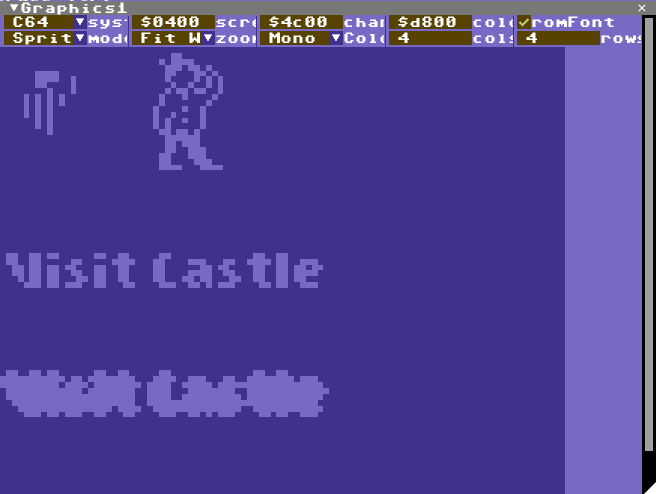

# Views

## Toolbar

The toolbar consists of buttons that controls the debugger and VICE such as Go/Stop, Step, Load a program/disk/cartridge or reload (a reload will clean VICE so you can iterate your code and start over without restarting VICE).
Connect will attach the debugger to an existing instance of VICE, Start VICE will try to start a new instance of VICE.
* Go/Stop: If VICE is connected start/stop execution, same as F5/Shift F5 on the keyboard.
* Step: If VICE is connected and stopped, step one instruction. Step in to jsr. Same as F11.
* Step Over: Step over jsr. Same as F10.
* Step Out: Run until exiting a subroutine (after calling jsr if possible). Same as Shift F11
* Load: Open the load program dialog, select a .prg, .d64 or .crt file. VICE will reset then load in the program.
* Reload: repeat the last file opened using Load
* Reset: Reset the c64 in VICE
* Connect/Disconnect: Connect to a running instance of VICE or disconnect if already connected
* Start/Quit VICE: Load VICE or if already connected, Quit VICE.

## Code View

Disassembly and Source Debugging lives here, but that is not all. There are a number of optional "columns" to customize this view

* Address
* Bytes - the bytes that makes up each instruction
* Disassembly - you can hide the disassembly to save some screen space for Source Debugging
* References - looks at the address the instruction is referencing and shows what it currently contains
* Labels - *not* a column, but expands addresses in instructions into labels if found
* Source - show or hide source debugging (if available)

Addresses can be selected in the disassembly by clicking on them.
A purple cursor shows the current selected address. Addresses can be navigated with cursor up/down and page up/down.

Keyboard shortcuts while the code view is selected:
* Tab: jump to current PC
* Shift+Tab: set PC to current selected address
* Cursor up/down: move cursor to previous/next addresss
* Page up/down: move cursor half a screen
* F9: Toggle breakpoint at line
* Enter: edit disassembly at address

The address field can be any expression  that evaluates, either a hex value preceeded by $ or a decimal value. It can also be an expression, see the Watch View for expression details.

If the address field expression is preceeded by = this means lock the view to the expression which can be handy to for example see the address of the jsr instruction that entered the code unless other data is on the stack:

	={$101+s}-2

## Watch View

A watch is a live expression, type in any expression here to monitor the result at any time.

Each watch expression will be saved to the .ini file at shutdown.

Expression operators are:
* '==': 1 if left is same as right side otherwise 0. Can also use '='
* '<', '<=', '>', '>=": less than, less or equal, greater, greater or equal. 1 if true otherwise 0
* '(', ')': parenthesis can be used to scope parts of expressions
* '{', '}': 16 bit value at address within { and }, for example {$fffe} would be the current interrupt address
* '[', ']': 8 bit value at address within [ and ], for example [1] would be current ROM bank value
* '+': sum of left side and right side
* '-': left side subtracted by right side
* '*': product of left and right sides
* '/': left side divided by right side
* '&': bitwise and
* '&&': conditional and, if left side and right side are both non-zero this is 1 otherwise 0
* '|': bitwise or
* '||': conditional or
* '^': bitwise exclusive or
* '!': "not", if right side is 0 then this is 1, otherwise 0
* '$': prefix for hex values
* '%': prefix for octal values
* 'A', 'X', 'Y': value of register
* 'S': stack pointer
* 'C', 'Z', 'I', 'D', 'V', 'N': value of flag register, each is 0 or 1
* 'P': all above flags in one byte

## Console View

This is a combination of the VICE text monitor, if enabled in VICE, and some extra commands for IceBro Lite.

To use the console view the remote monitor must be enabled in VICE in addition to the remote binary monitor. This enables a few more features not available in the binary protocol. Tracepoint output will be filtered into the Trace View instead.

Type help or ? for a list of VICE commands when connected to VICE, or type CMD for a list of IceBro Lite commands. VICE text monitor output will be shown in this view.

## Graphics View

The Graphics View is a viewer for graphics anywhere in RAM in a
variety of modes.

This view has a lot of fields where addresses and numbers can be edited. It is a little complicated because the C64 has so many ways to show graphics. Here is a quick overview:
* System: C64 layouts or General layout
* Screen: Address of Screen Data
* Chars: Address of font/bitmap/sprite
* Color: Address of color RAM (always $d800 on a C64, but can be pointed anywhere in the debugger)
* romFont: Graphics in $1000-$1fff and $9000-$9fff uses the built-in font data
* Mode: A variety of graphics modes including text, bitmap, sprites, etc. etc. depending on the current System setting.
* Zoom: How to size the graphics in the view
* Col: number of columns (chars or sprites)
* Row: number of rows (chars or sprites)

If the Graphics View is selected press CTRL+C to copy the graphics to the clipboard (Windows only at the moment).

## Breakpoint View

The Breakpoint View is a list of the current checkpoints which includes breakpoints (stop on execution of address), watchpoints (stop when reading or writing to an address or range), tracepoints (tracks loading/storing/execution but does not stop VICE).

While debugging code it is usually easiest to toggle breakpoints from the code view, at the top of the Breakpoint View there is a drop down to create other types of checkpoints.

Breakpoint addresses can be dragged from the breakpoint table into the Code tab to see the code at the breakpoint, or to the memory view along with anything you can drag a symbol to.

In the table a checkpoint can be selected, conditions can be added, clicking on a checkpoint icon disables/enables the checkpoint.

Keyboard shortcuts when a checkpoint is selected:
* cursor up/down: move to previous/next checkpoint in table
* Delete: delete the selected checkpoint

## Trace View

Tracepoints have their own view as they are not stopping VICE but are counted.

Each Tracepoints has an ID and in the Trace View there is a dropdown to select a trace to display. This includes which address the trace was hit, the PC when it was hit, line & cycle and an estimated frame from the first trace. The frame number is currently assuming European PAL timing.

A tooltip will show disassembly, registers and flags when the mouse cursor hovers above a trace sample.

Since the binary monitor protocol doesn't include all the same info as the text monitor protocol the list of breakpoints must first be listed in the Vice Console to generate the trace output. Type "bk" in the Vice Console to do this.

## Memory View

Review and edit bytes in the memory view.

The memory view is fairly standard, type an address or enter an expression or drag a symbol to the window tab to view memory at that location. The number of bytes per line depends on the width of the window unless there is a value in the span field.

Click on any byte to start editing hex values and use cursor keys to move the cursor, page up/down to move half a screen each keypress.

## Register View

In this view you can quickly check the current registers and flags and also edit them while VICE is stopped. Just click on any value and edit, cursor left/right to navigate when editing is active. Press Esc to stop editing.

## Screen View

The screen view is a little redundant but for my own convenience I tend to forget exactly how the screen looks in VICE when I break it and VICE may be hidden behind the debugger window so I can just look at this view instead of switching between windows. This image is generated by VICE so it includes all the raster changes that the Graphics View can not pick up.

* Press CTRL+C to copy the graphics to the clipboard (Windows only at the moment)

## Symbol View

Symbols include both simple constants and memory addresses so there are often a lot more symbols to
keep track of than you can remember. For that purpose there is a search feature in the symbol browser
to help quickly get to draggable symbols.

You can drag any symbol from this table into the tab of the Code View to look at code at that address, or the Memory View to look at memory, or to the Breakpoint View to add a breakpoint at that address, along with several other text fields. I'm updating the targets as I figure out what is useful.

You can leave any search field (Search/start/end) empty to leave the search open ended.
* Search is a regular expression (see constructs below)
* case enables/disables case sensitivity in the search pattern
* start is the lowest address/value to filter by
* end is the highest address/value to filter by

Regular expression tokens include:
* ? => any single character
* \# => any single number
* [] => any single between the brackets
* [-] => any single char in the range from character before - to character after
* [!] => any single char not between the brackets
* < => start of word
* \> => end of word
* @ => start of line
* ^ => end of line
* \* => any substring
* \*\% => any substring excluding whitespace
* *@ => any substring on same line
* *$ => any substring containing alphanumeric ascii characters
* *{} => any substring only containing characters between parenthesis
* *{!} => any substring not containing characters between parenthesis
* \?, \[, \*, etc. => search for character after backslash
* \n, \t, etc. => search for linefeed, tab etc.

## Section View

This view controls which sections (or segments) are enabled for symbols and source debugging.
