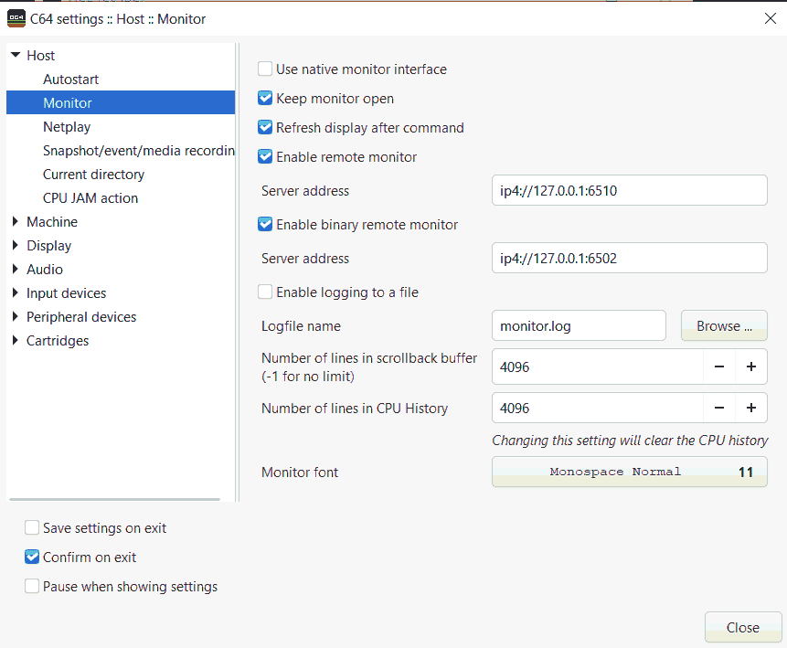
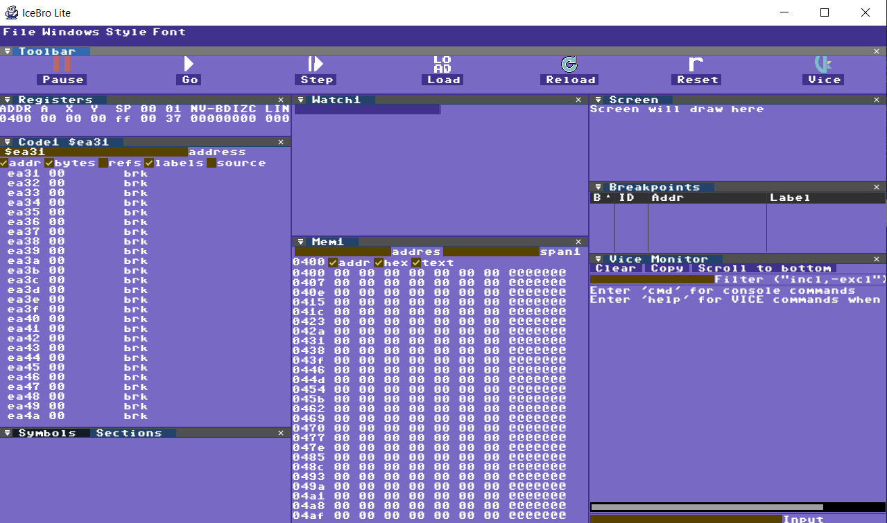
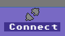
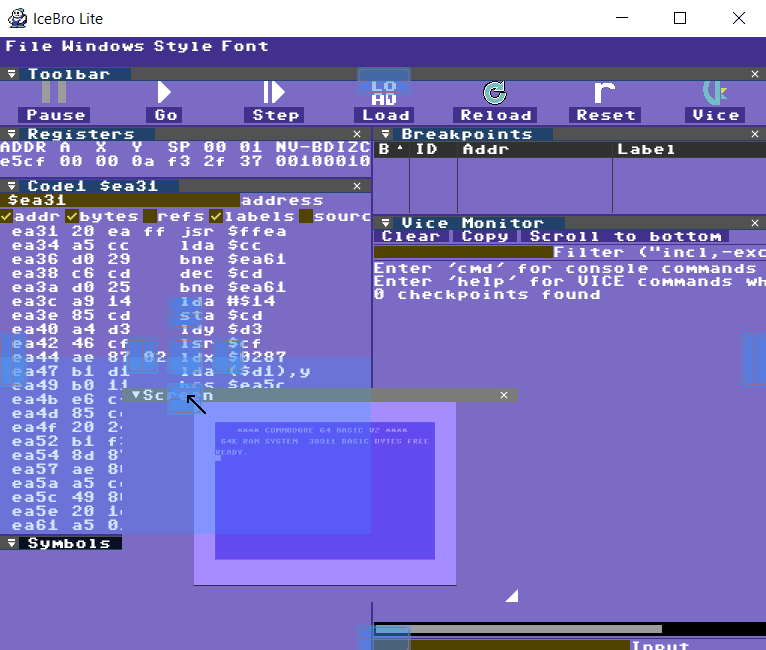
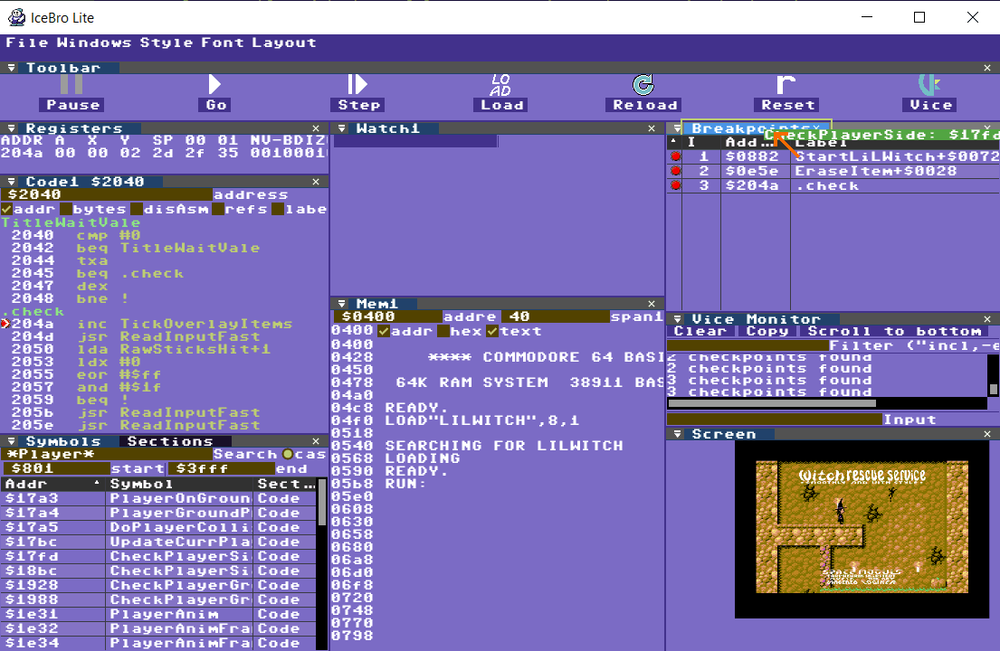
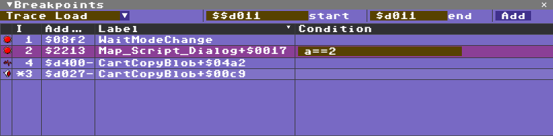
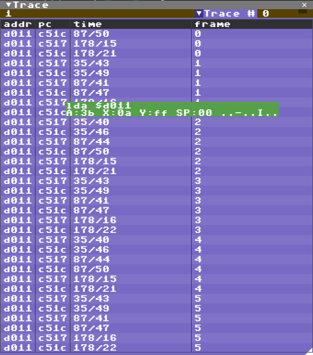
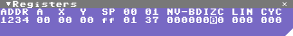

# IceBro Lite Manual

	Note: This document is still in development. It is a bit longer than I anticipated and there is still more things to add and it will be updated soon. If anything needs more clarification please let me know

## What is IceBro Lite

IceBro Lite is a source-level debugger with a graphical user interface (GUI). The primary purpose of the IceBro Lite debugger is to inspect and validate assembler code.

IceBro Lite is designed for use with the VICE C64 emulator, version 3.5. More specifically, it’s built to take advantage of the new binary monitor protocol introduced in VICE C64 3.5. More details about the binary protocol can be found here:

https://vice-emu.sourceforge.io/vice_13.html

**VICE versions older than 3.5 are not compatible with this debugger.** However, if you’d like to keep an earlier version of VICE installed, just install VICE 3.5 into a separate folder.

There are two ways to go about debugging a program in IceBro Lite:
1) Start the program in VICE, then connect the debugger to VICE.
2) Connect VICE to the debugger, then load (and reload) the program from within the debugger.

**Feedback is always welcome**

I'd love to hear thoughts about IceBro Lite and ways to improve it, for instance on twitter [@spacemoguls](https://twitter.com/spacemoguls).

# Setting up your system

### VICE Settings

To set up your system for debugging, do the following:
1) Enable external debugging in VICE. You normally only need to do this once as long as you save the settings

2) Connect the debugger to VICE. This you have to do every time you start the debugger up.

Alternatively to the above steps you can start IceBro Lite and then start VICE from the File/Load VICE menu which will start VICE with the settings enabled.
  
The following sections will describe these steps in detail.
## Enable external debugging in VICE

To enable external debugging in VICE, you must enable the binary monitor and – ideally – the text mode monitor protocols.

Please note that if you wish to enable the built-in monitor of the VICE emulator again, you may have to disable external debugging. 

Follow these steps to enable external debugging in VICE:

**Step 1**: Go to Settings / Settings in the menu.
First find the settings menu 

**Step 2**: Check Enable Remote Monitor and Enable Binary Remote Monitor in the Host / Monitor sub-menu.

**Step 3**: (not mandatory) Check Save settings on exit to avoid having to repeat the procedure at a future point.

**Step 4**: Done! VICE is now ready to accept a binary debugger connection.

# Connect the debugger to VICE

The EXE file for IceBro Lite is called IceBroLite.exe. It’s warmly recommended to launch the file directly from the command prompt – or from a batch script – in your project folder. This is because the debugger will save its layout in a text file in the folder from where it was launched.

Note: If you are using source control (git, svn, etc.), consider ignoring "icebrolt.ini" in your project directory if using in different environments as it stores full path names to previously loaded files.

**Step 1**: Launch IceBroLite.exe (see recommendations earlier in this section).

**Step 2**: Make sure VICE is running and has the binary remote monitor enabled.

**Step 3**: Click on the VICE icon at the top right corner of the screen.

When the icon turns cyan, VICE is connected. 

**Step 4**: Press the PAUSE icon to look around in the current memory of VICE's C64 instance.

**Step 5**: Done!

# Customizing your debugging window

The IceBro Lite debugging window is fully customizable. It is made up of separate panes, which you may move around and reorganize at will. This is similar to the way e.g. Visual Studio organizes windows. 

Close the panes you don’t need. Reopen them again – or open new ones – from the Windows drop-down menu. 

In order to move a pane around, grab it by its tab (the bar with the name of each pane, such as Code, Graphics, Watch, etc.) then drag it around with your mouse. If you place it on top of an anchor in another pane the debugger will preview where the pane will be placed if you drop it.

Panes can also be dropped outside of the main window and become detached windows, onto which other panes may be attached. This makes it possible to work with multiple groupings of windows.

If you reopen a closed pane, it will reappear at its most recent location. You reopen panes from the Windows menu.

Should any problem arise with the tool layout, you may reset it from the drop-down menu.

To re-open closed windows simply select them from te Windows drop down menu.

# Start Debugging

Note that when connected to VICE, the debugger will only update the machine state after you’ve stopped VICE. There are several ways to stop VICE:
- Press the pause button in the debugger
- Hit Alt+H in Vice
- Hit a breaking checkpoint (break, watch) while executing the code.

## Start executing the program to debug
There are two ways to go about debugging a program in IceBro Lite:
1) Start executing the program in VICE, then connect the debugger to VICE.
2) Connect VICE to the debugger, then load (and reload) the program from within the debugger and execute it from there.

### Executing code from VICE

If you execute code from VICE you can browse for the appropriate symbol file from the debugger "File" menu. When the program is running, you can stop it from inside the debugger.

###Executing code from IceBro Lite

Follow these steps to launch a program from IceBro Lite:

**Step 1**: Click the LOAD icon in IceBro Lite.

**Step 2**: Select a .prg/.d64 or .crt file from the file browser.

The debugger will now try to find a .dbg file (Kick Assembler debugger data), or .sym file (general assembler symbol file) or .vs file (Vice monitor commands). It will then load symbols and source debug at the same time.

When the files are loaded into the debugger, the debugger will stop twice before running the code: first before it starts loading, and second when it is about to run the loaded code.

To return to VICE just press F5 or press the play icon in the toolbar.

**Step 3**: Done!

## How to debug – tips and advice
Debugging operations mainly involve dragging a symbol or pointer from one pane into another pane, in order to see what it does there. For this purpose you can drag symbols and pointers from e.g. the Symbol browser or Breakpoint to the tabs of other panes, such as the Code view, the Breakpoint view or the Memory view.

In the image below, a symbol from the Symbol pane is dragged to the Breakpoints view. This adds the symbol as a breakpoint in VICE.

### Keyboard controls

Global keys
* **F5**: Return to VICE / Run
* **F11**: Step Into as in step one instruction and follow into jsr instructions
* **F10**: Step Over, same as F11 but don't follow into jsr instructions
* **Esc**: Exit the current edit

Code pane Keys
* **F6**: Run until line with purple cursor is reached or any prior breakpoint
* **F9**: Toggle breakpoint at line with purple cursor
* **Enter**: Edit code at line with purple cursor, Esc or Enter on empty line to stop.

Memory pane Keys (after clicking on a byte)
* **Cursor keys**: Move around the cursor in memory
* **Hex numbers**: Modify value in memory

Breakpoint pane Keys (after clicking on a breakpoint)
* **Up/Down**: Move through breakpoints
* **Delete**: Delete breakpoint

# Views

## Toolbar

The toolbar consists of buttons that controls the debugger and VICE such as Go/Stop, Step, Load a program/disk/cartridge or reload (a reload will clean VICE so you can iterate your code and start over without restarting VICE).
Connect will attach the debugger to an existing instance of VICE, Start VICE will try to start a new instance of VICE.
* Go/Stop: If VICE is connected start/stop execution, same as F5/Shift F5 on the keyboard.
* Step: If VICE is connected and stopped, step one instruction. Step in to jsr. Same as F11.
* Step Over: Step over jsr. Same as F10.
* Step Out: Run until exiting a subroutine (after calling jsr if possible). Same as Shift F11
* Load: Open the load program dialog, select a .prg, .d64 or .crt file. VICE will reset then load in the program.
* Reload: repeat the last file opened using Load
* Reset: Reset the c64 in VICE
* Connect/Disconnect: Connect to a running instance of VICE or disconnect if already connected
* Start/Quit VICE: Load VICE or if already connected, Quit VICE.

## Code View

Disassembly and Source Debugging lives here, but that is not all. There are a number of optional "columns" to customize this view

* Address
* Bytes - the bytes that makes up each instruction
* Disassembly - you can hide the disassembly to save some screen space for Source Debugging
* References - looks at the address the instruction is referencing and shows what it currently contains
* Labels - *not* a column, but expands addresses in instructions into labels if found
* Source - show or hide source debugging (if available)

Addresses can be selected in the disassembly by clicking on them.
A purple cursor shows the current selected address. Addresses can be navigated with cursor up/down and page up/down.

Keyboard shortcuts while the code view is selected:
* Tab: jump to current PC
* Shift+Tab: set PC to current selected address
* Cursor up/down: move cursor to previous/next addresss
* Page up/down: move cursor half a screen
* F9: Toggle breakpoint at line
* Enter: edit disassembly at address

The address field can be any expression  that evaluates, either a hex value preceeded by $ or a decimal value. It can also be an expression, see the Watch View for expression details.

If the address field expression is preceeded by = this means lock the view to the expression which can be handy to for example see the address of the jsr instruction that entered the code unless other data is on the stack:

	={$101+s}-2

## Watch View

A watch is a live expression, type in any expression here to monitor the result at any time.

Each watch expression will be saved to the .ini file at shutdown.

Expression operators are:
* '==': 1 if left is same as right side otherwise 0. Can also use '='
* '<', '<=', '>', '>=": less than, less or equal, greater, greater or equal. 1 if true otherwise 0
* '(', ')': parenthesis can be used to scope parts of expressions
* '{', '}': 16 bit value at address within { and }, for example {$fffe} would be the current interrupt address
* '[', ']': 8 bit value at address within [ and ], for example [1] would be current ROM bank value
* '+': sum of left side and right side
* '-': left side subtracted by right side
* '*': product of left and right sides
* '/': left side divided by right side
* '&': bitwise and
* '&&': conditional and, if left side and right side are both non-zero this is 1 otherwise 0
* '|': bitwise or
* '||': conditional or
* '^': bitwise exclusive or
* '!': "not", if right side is 0 then this is 1, otherwise 0
* '$': prefix for hex values
* '%': prefix for octal values
* 'A', 'X', 'Y': value of register
* 'S': stack pointer
* 'C', 'Z', 'I', 'D', 'V', 'N': value of flag register, each is 0 or 1
* 'P': all above flags in one byte

## Console View

This is a combination of the VICE text monitor, if enabled in VICE, and some extra commands for IceBro Lite.

To use the console view the remote monitor must be enabled in VICE in addition to the remote binary monitor. This enables a few more features not available in the binary protocol. Tracepoint output will be filtered into the Trace View instead.

Type help or ? for a list of VICE commands when connected to VICE, or type CMD for a list of IceBro Lite commands. VICE text monitor output will be shown in this view.

## Graphics View

The Graphics View is a viewer for graphics anywhere in RAM in a
variety of modes.

This view has a lot of fields where addresses and numbers can be edited. It is a little complicated because the C64 has so many ways to show graphics. Here is a quick overview:
* System: C64 layouts or General layout
* Screen: Address of Screen Data
* Chars: Address of font/bitmap/sprite
* Color: Address of color RAM (always $d800 on a C64, but can be pointed anywhere in the debugger)
* romFont: Graphics in $1000-$1fff and $9000-$9fff uses the built-in font data
* Mode: A variety of graphics modes including text, bitmap, sprites, etc. etc. depending on the current System setting.
* Zoom: How to size the graphics in the view
* Col: number of columns (chars or sprites)
* Row: number of rows (chars or sprites)

If the Graphics View is selected press CTRL+C to copy the graphics to the clipboard (Windows only at the moment).

## Breakpoint View

The Breakpoint View is a list of the current checkpoints which includes breakpoints (stop on execution of address), watchpoints (stop when reading or writing to an address or range), tracepoints (tracks loading/storing/execution but does not stop VICE).

While debugging code it is usually easiest to toggle breakpoints from the code view, at the top of the Breakpoint View there is a drop down to create other types of checkpoints.

In the table a checkpoint can be selected, conditions can be added, clicking on a checkpoint icon disables/enables the checkpoint.

Keyboard shortcuts when a checkpoint is selected:
* cursor up/down: move to previous/next checkpoint in table
* Delete: delete the selected checkpoint

## Trace View

Tracepoints have their own view as they are not stopping VICE but are counted.

Each Tracepoints has an ID and in the Trace View there is a dropdown to select a trace to display. This includes which address the trace was hit, the PC when it was hit, line & cycle and an estimated frame from the first trace. The frame number is currently assuming European PAL timing.

A tooltip will show disassembly, registers and flags when the mouse cursor hovers above a trace sample.

Since the binary monitor protocol doesn't include all the same info as the text monitor protocol the list of breakpoints must first be listed in the Vice Console to generate the trace output. Type "bk" in the Vice Console to do this.

## Memory View

..

## Register View

In this view you can quickly check the current registers and flags and also edit them while VICE is stopped. Just click on any value and edit, cursor left/right to navigate when editing is active. Press Esc to stop editing.

## Screen View

* Press CTRL+C to copy the graphics to the clipboard (Windows only at the moment)

## Symbol View

...

## Section View

...

# Acknowledgements

### Dear ImGui
Copyright (c) 2014-2021 Omar Cornut, licensed under the MIT Licence, for more information see src/imgui/LICENSE.txt
Dead ImGui can be downloaded from https://github.com/ocornut/imgui

### C64 Font TTF format

Fonts in this package are(c) 2010 - 2014 Style. Used with permission from Style as an embedded binary font. For more information see the top of src/data/C64_Pro_Mono-STYLE.ttf.cpp

### Default Style by MonstersGoBoom

Palette and color assigments by MonstersGoBoom, used with permission

### VICE C64

This tool does not include any code from VICE C64 but interfaces with it using a network connection. VICE C64 download and related licenses can be found at https://vice-emu.sourceforge.io/