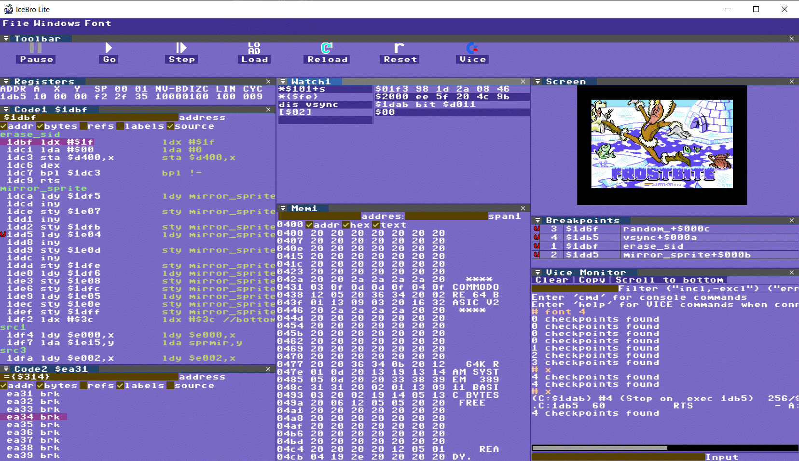
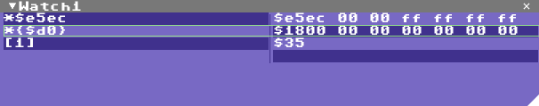
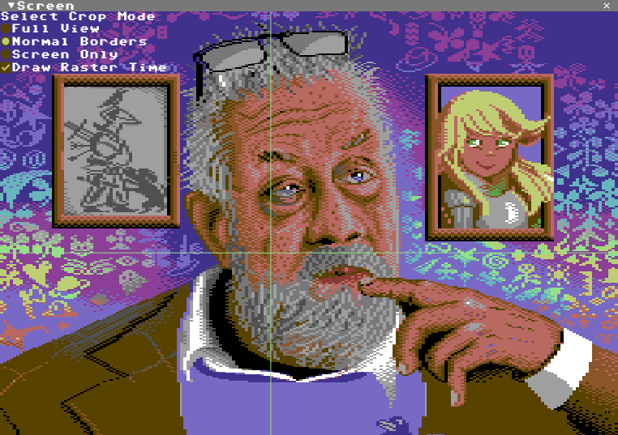

# IceBro Lite

I've started writing a [manual](manual.MD)!

Most information below might be outdated, I haven't updated this as I've updated the code.

Checking Witch Rescue Service out in IceBro Lite

# Releases

Releases have moved to github [releases](https://github.com/Sakrac/IceBroLite/releases/)

### Differences from IceBro

IceBro Lite doesn't contain its own 6502 emulator for debugging "post mortem" which makes it a lot simpler to understand. When it is ready it should function similar to the command line monitor of vice only with a graphical user interface and more visualizations of the current state.

### Status

Finally decided on a release, 1.0. However, did not check with latest VICE (3.6.1) so I will need to update.

### Updates

Release 1.0 fixes lots of minor annoyances from the previous release candidate.

Upcoming fixes post 1.0 include VICE 3.6.1 support (VICE 3.5 likely not fully compatilble anymore)

Debugger views improvements:

Watch View now has keyboard controls while the view is active. A light green rectangle indicates
the current watch, press Enter to modify the expression, Delete to delete it or Insert to insert
a new watch. Press up/down to move between watch slots.

Added Show All/Hide All buttons to quickly choose the right set of active symbols and source debug sets.
Also saves the selection in icebrolt.ini so it will be active on debugger restart. The hidden sections
are no longer erased whenever the program in reloaded!

Added cropping options for showing border, full raster time or just the screen. There is also a raster time
option to illustrate the current cpu clock raster position.

