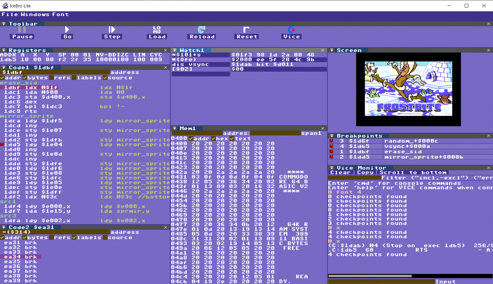

# IceBro Lite

IceBro Lite is a graphical debugger for Commodore 8-bit programs that connects to VICE and displays source, disassembly, registers, memory, watches, breakpoints, graphics and trace data in a dockable interface.

The current codebase uses CMake with Ninja, ImGui and the Sokol backend layer. It builds on Windows, Linux and macOS.

## Build

1. Run the dependency helper script in the repository root:
   - Windows: get_dependencies.bat
   - Linux/macOS: get_dependencies.sh
2. Configure and build with the appropriate preset:
   - Windows: build_cmake.bat or `cmake -G Ninja -S . -B build --preset x64-release`
   - Linux: build_cmake.sh or `cmake -G Ninja -S . -B build --preset linux-release`
   - macOS: `cmake -G Ninja -S . -B build --preset macos-release`
3. Launch the executable from a working directory where the debugger can write its layout file (`icebrolt.ini`).

Build prerequisites are described in [dependencies.md](dependencies.md). Additional platform-specific notes are in [linux.MD](linux.MD) and [mac.MD](mac.MD).

## Getting started

- Enable the Remote Monitor and Binary Remote Monitor in VICE.
- Start IceBro Lite and either use the Start Vice button to launch VICE or connect to an existing VICE process.
- Load a program with the toolbar Load button or pass `-load=<file>` on the command line.
- The debugger can also load `.dbg`, `.sym` and `.vs` files automatically when their names match the loaded program.

The full manual lives in the [docs](docs/index.md) folder.

